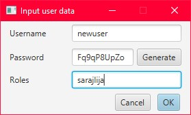

# ChatApp
Chat app project for Razvoj Programskih Rjesenja class

# Quick start guide:
rename example.server.properties inside the resources folder file to client.properties and fill it out 
then run the ChatAppServer class  

then do the same for example.client.properties file 
then run the ChatAppClient class
   
Screenshots:  
 
 
 
 

  
icons sourced from https://github.com/feathericons/feather