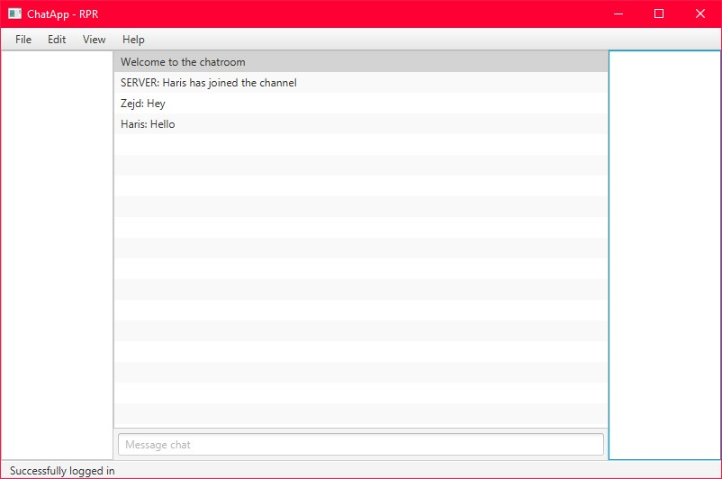

# ChatApp
Chat app project for Razvoj Programskih Rjesenja class


# Quick start guide:
make a client.properties file inside the resources folder of ChatAppServerRelay module and fill in the following properties
```
server.port=30120
db.ip=127.0.0.1
db.port=3306
db.name=database
db.user=root
db.password=root
```
then run the Main class<br><br>

make a client.properties inside the resources folder of ChatApp module file and fill in the following properties
```
server.ip=127.0.0.1
server.port=30120
```
and then run the ChatAppClient class
<br><br><br>
Screenshots:<br>

